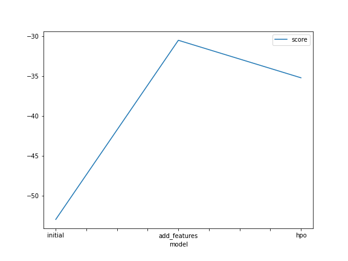
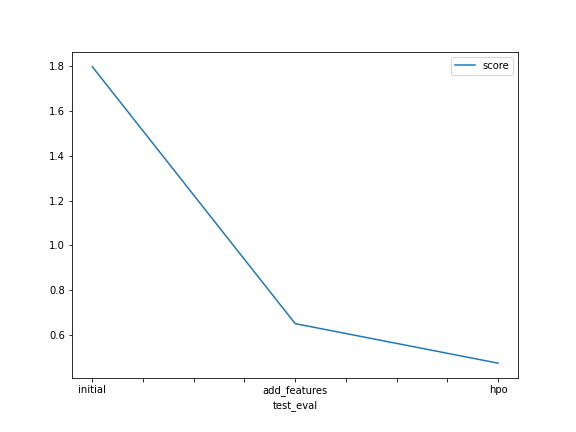

# Report: Predict Bike Sharing Demand with AutoGluon Solution
### Ahmed Al Qady

## Initial Training
### What did you realize when you tried to submit your predictions? What changes were needed to the output of the predictor to submit your results?
Everything need to be greater than zero in order to be a successful submission, and i had to work with a lot of challenges to run everything locally on macOS.

### What was the top ranked model that performed?
The third run provided the model with the best kaggle score of 0.47468

## Exploratory data analysis and feature creation
### What did the exploratory analysis find and how did you add additional features?
EDA shows that date and time must be reformatted into more features, there are 3 categories for weather and workday and holiday are binary fields, and while humidity is left skewed, windspread is right skewed.

### How much better did your model preform after adding additional features and why do you think that is?
Spliting the date into year,month,day,hour gives the best improvement.

## Hyper parameter tuning
### How much better did your model preform after trying different hyper parameters?
The hyper tuned model provided the best kaggle score, it was achieved by following "autogluon-tabular hyperparameters" page in aws documentation. 

### If you were given more time with this dataset, where do you think you would spend more time?
I'd spend more time trying to improve the features, maybe adjusting the model to consider seasonal data and working hours enhances the model.

### Create a table with the models you ran, the hyperparameters modified, and the kaggle score.

|model       |timelimit|presets      |method                     |score|
|initial     |600      |best_quality |none                       |1.79759|
|add_features|600      |best_quality |problem_type = 'regression'|0.65103|
|hpo         |600      |best_quality |tabular autogluon          |0.47468|

### Create a line plot showing the top model score for the three (or more) training runs during the project.

### Create a line plot showing the top kaggle score for the three (or more) prediction submissions during the project.

## Summary
Working with features provides the most gains and future work should consider the working hours and seasonal-depending-data.