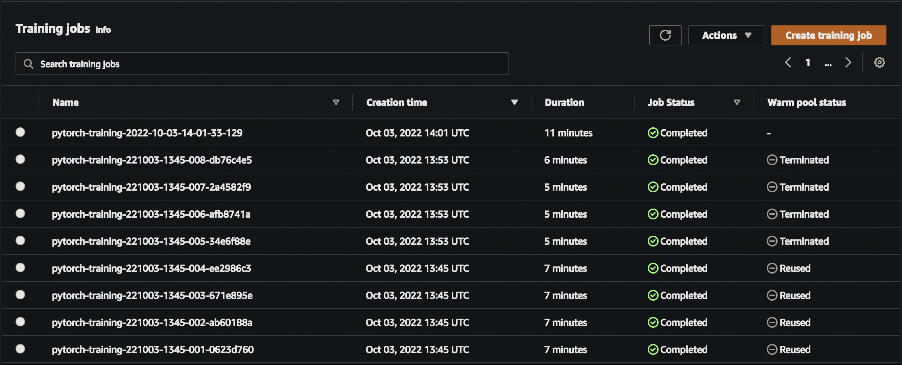
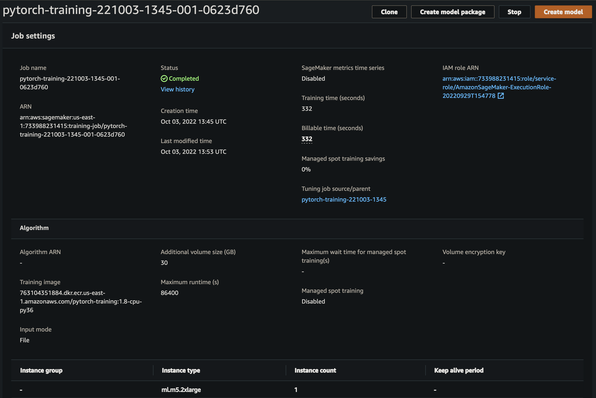
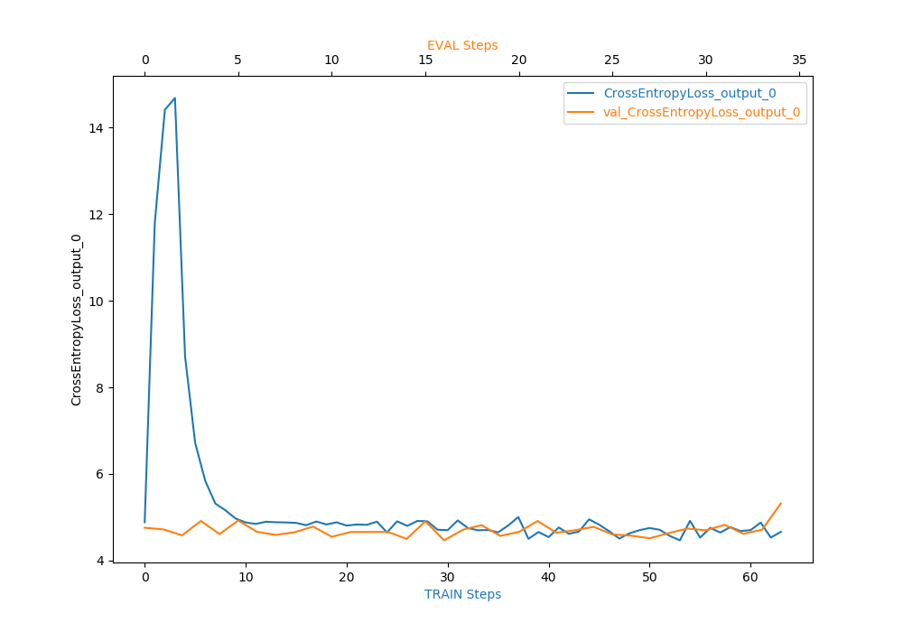
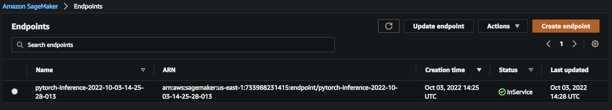

# Image Classification using AWS SageMaker

Use AWS Sagemaker to train a pretrained model that can perform image classification by using the Sagemaker profiling, debugger, hyperparameter tuning and other good ML engineering practices. This can be done on either the provided dog breed classication data set or one of your choice.

## Project Set Up and Installation
Enter AWS through the gateway in the course and open SageMaker Studio. 
Download the starter files.
Download/Make the dataset available. 

## Dataset
The provided dataset is the dogbreed classification dataset which can be found in the classroom.
The project is designed to be dataset independent so if there is a dataset that is more interesting or relevant to your work, you are welcome to use it to complete the project.

### Access
Upload the data to an S3 bucket through the AWS Gateway so that SageMaker has access to the data. 

## Hyperparameter Tuning
What kind of model did you choose for this experiment and why? Give an overview of the types of parameters and their ranges used for the hyperparameter search

Remember that your README should:
- Include a screenshot of completed training jobs
- Logs metrics during the training process
- Tune at least two hyperparameters
- Retrieve the best best hyperparameters from all your training jobs

Hyperparameter tuning ranges:

Learning rate tuned range: 0.001, 0.1
Batch size was tuned values: 32, 64, 128, 256, 512

## Debugging and Profiling
**Done**: Give an overview of how you performed model debugging and profiling in Sagemaker

Model debugging is handled in train_model.py and rules for the debugger and the profilers is made in the jupyter notebook train_and_deploy.ipy

Used best hyperparameters aquired from previous step:
Learning rate: 0.011079929912393472
Batch size: 32

For this project and to speed up model training, instead of training on the entire dataset, only 15% of the dataset is used to train the model.

### Results
**Done**: What are the results/insights did you get by profiling/debugging your model?
Learning parameters over time plot:

**Done** Remember to provide the profiler html/pdf file in your submission.
Profiler results [here](profiler-report.html)

## Model Deployment
**Done**: Give an overview of the deployed model and instructions on how to query the endpoint with a sample input.

To deploy, the model should be loaded from and the image should be resized to 224x224px and pass it to the network.

The python script inference.py provides the entry point for the network so it can load and preprocess the image.

**Done** Remember to provide a screenshot of the deployed active endpoint in Sagemaker.

## Standout Suggestions
**Done (Optional):** This is where you can provide information about any standout suggestions that you have attempted.

To ensure i don't run out of budget, i worked on my local machine for this entire course and the project then modified the  project code to run on AWS.