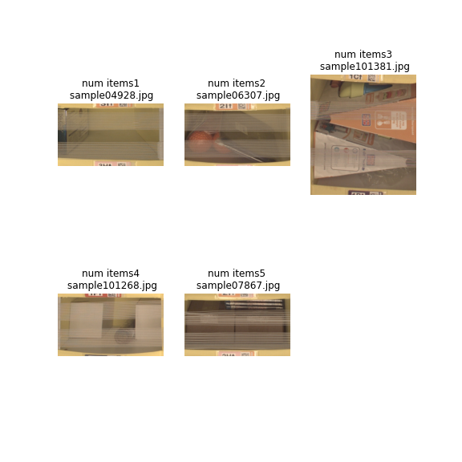
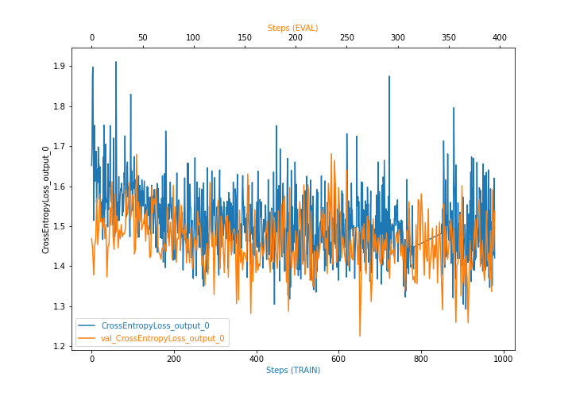
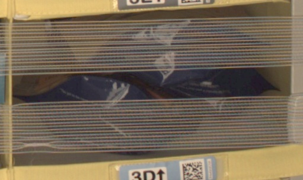

# Inventory Monitoring at Distribution Centers

Huge warehouses like Amazon requires reliable automated systems that sort and distribute packages. These packages can hold multiple items, therefore an automated system that counts the items in each package is required. Such system needs to be reliable and be able  to  identify  and  count  items  correctly  even  if  the  input  photo  is  not  very  clear.  This capstone project is about developing such system.

## Project Set Up and Installation

This code needs AWS services to operate, it uses Sagemaker and S3.
Recommended machines to run this code:
- Notebook instance: ml.t3.medium
- Training: ml.m5.xlarge

## Dataset

Amazon Bin Image Dataset contains photos of packages with a metadata file that shows the number of items in the package. This dataset will be used to train a model that can count  the  number  of  items  in  each  package.

### Overview

This  project  will  use  only  10,000  images  from  Amazon  Bin  Image  Dataset  to  keep  the project  size  reasonable.  Post-processing  the  dataset  divides  it  into  train,  test  and validati  n sets using ratios of 60%, 20%, 20% and the number of images per class will be similar.

### Access

The dataset is processed and then uploaded to S3 container.

## Model Training

ResNet-50 is a 50 layers deep convolution neural network, it has an image input size of 224x224, a pre-trained version of this network is available in AWS which was trained on more  than  a  million  images  from  the  ImageNet  dataset,  therefore  it  learned  rich  feature representation for a wide range of images, so it will be used as a baseline model in this project. Training the model on the entire dataset took an hour to complete.

### Hyperparameters tuning

hpo.py script executes a single epoch on 10% of the dataset to determine the best hyperparameters to be used when training the model. 
- Learning rate was tuned for the range of (0.001, 0.1) and the optimal value found is 0.0019270438362405597
- Batch size was tuned for values of (32, 64, 128, 256, 512) and the optimal value found was 32

### Model evaluation and debugging

Sagemaker debugger was used in this project and it generated the following plot:

## Model deployment

The code in the notebook deploys the model to an endpoint so. it can be queried.

## Model Inference

After deploying the endpoint a prediction can be made using a test image.

