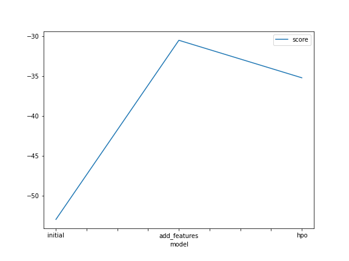
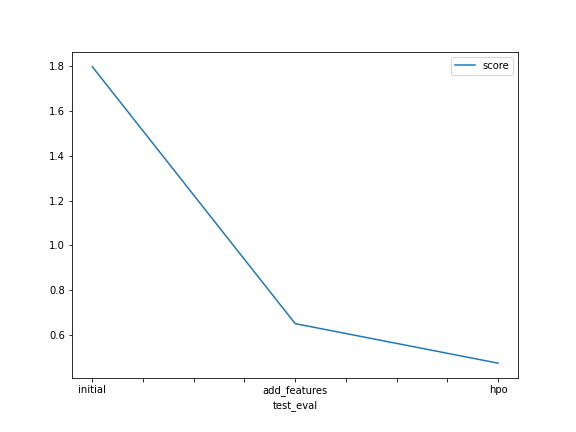

# Predict Bike Sharing Demand with AutoGluon

## Overview
In this project, machine learning models were trained to predict bike sharing demand and compete in a Kaggle competition using the AutoGluon library.

Competition link:
https://www.kaggle.com/competitions/bike-sharing-demand/

## Models Performance 

|model       |timelimit|presets      |method                     |score|
|initial     |600      |best_quality |none                       |1.79759|
|add_features|600      |best_quality |problem_type = 'regression'|0.65103|
|hpo         |600      |best_quality |tabular autogluon          |0.47468|

## Top mModel Score Plot

## Top Kaggle Score Plot

## Project Instructions

1. Create an account with Kaggle.
2. Download the Kaggle dataset using the kaggle python library.
3. Train a model using AutoGluon’s Tabular Prediction and submit predictions to Kaggle for ranking.
4. Use Pandas to do some exploratory analysis and create a new feature, saving new versions of the train and test dataset.
5. Rerun the model and submit the new predictions for ranking.
6. Tune at least 3 different hyperparameters from AutoGluon and resubmit predictions to rank higher on Kaggle.
7. Write up a report on how improvements were made by either creating additional features or tuning hyperparameters, and why you think one or the other is the best approach to invest more time in.

